Server Replacement
------------------
The process of replacing a server is initiated from the
Server Summary. Replacing a will remove the existing server
from the Cloud configuration and install the new server
in its place. The rest of this process varies slightly
depending on the type of server being replaced.

Control Plane Servers
~~~~~~~~~~~~~~~~~~~~~
Servers that are part of the control plane (generally those
that are not hosting Compute VMs or ephemeral storage) are
replaced "in-place", such that the replacement server has
the same IP Address and is expected to have the same
NIC Mapping and Server Group as the server being replaced.

To replace a Control Plane server, click the menu to the
right of the server on the Summary tab of the Servers page.
From the menu options, select "Replace".

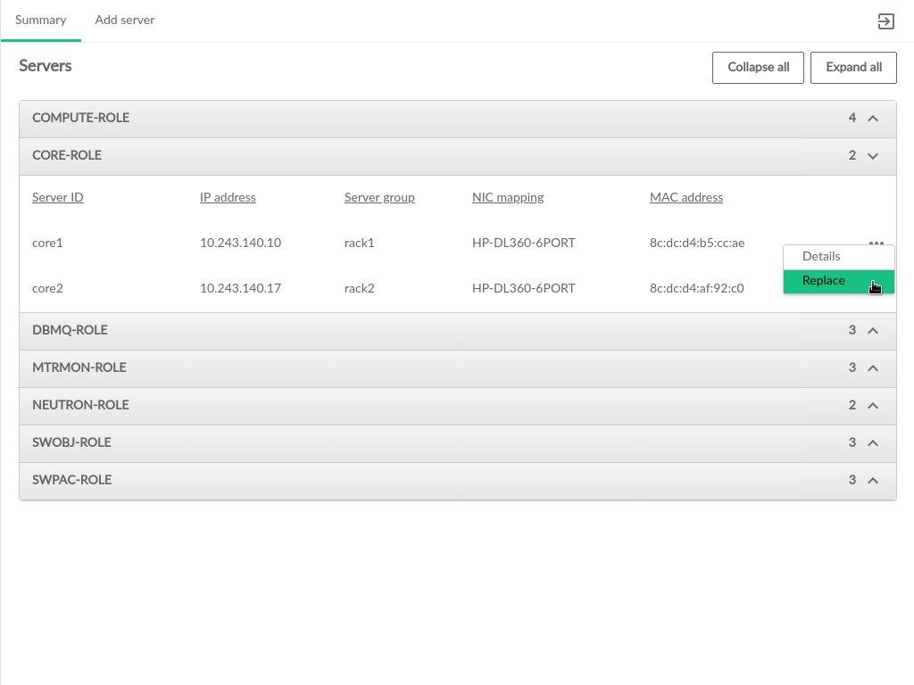

Selecting "Replace" will open a dialog box that includes
information about the server being replaced, as well as a form
for inputting the required information for the new server.

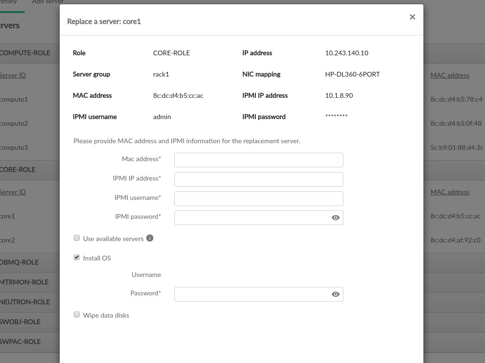

The new servers IPMI information is required to perform the
replacement process. 

Mac Address::
  The hardware address of the servers primary physical ethernet adapter

IPMI IP Address::
  The network address for IPMI access to the new server

IPMI Username::
  The username credential for IPMI access to the new server

IPMI Password::
  The password associated with the user entered to access IPMI on the new server

If SLES is not already installed, or to reinstall SLES on the new server,
check the box for "Install OS". The username will be pre-populated with the
username from the Cloud install. Installing the OS requires specifying the
password that was used for deploying the cloud so that the replacement
process can access the host after the OS is installed.

The data disks on the new server will not be wiped by default, but users
can specify to wipe clean the data disks as part of the replacement process.

Once the new server information is set, click the "Replace" button in the lower
right to begin replacement. A list of the replacement process steps will be
displayed, and there will be a link at the bottom of the list to show the log
file as the changes are made.

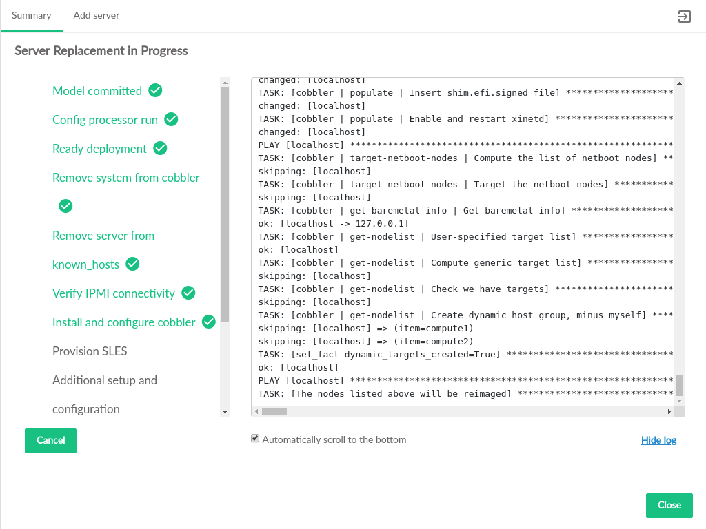

Once all of the steps are complete, click "Close" to return to the Servers page.

Compute Servers
~~~~~~~~~~~~~~~
Servers that host VMs are replaced in a fashion that
adds a new server, migrates existing instances from the
existing server to the new server, and then deletes the
existing server from the model. The new server will not have
the same IP Address and may have a different
NIC Mapping and Server Group than the server being replaced.

To replace a Compute server, click the menu to the
right of the server on the Summary tab of the Servers page.
From the menu options, select "Replace".

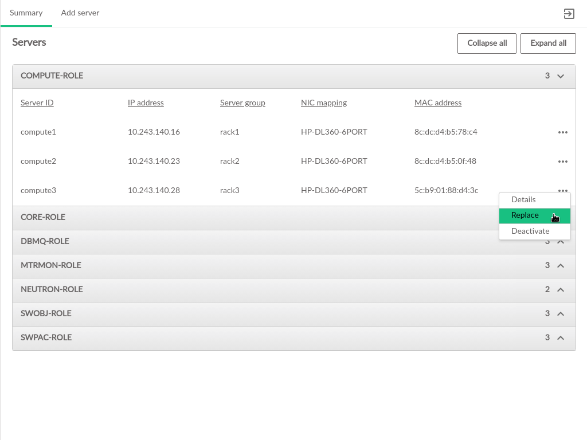

Selecting "Replace" will open a dialog box that includes
information about the server being replaced, as well as a form
for inputting the required information for the new server.

If the IP address of the server being replaced cannot be reached
by the deployer, a warning will appear to verify that the replacement
should continue.

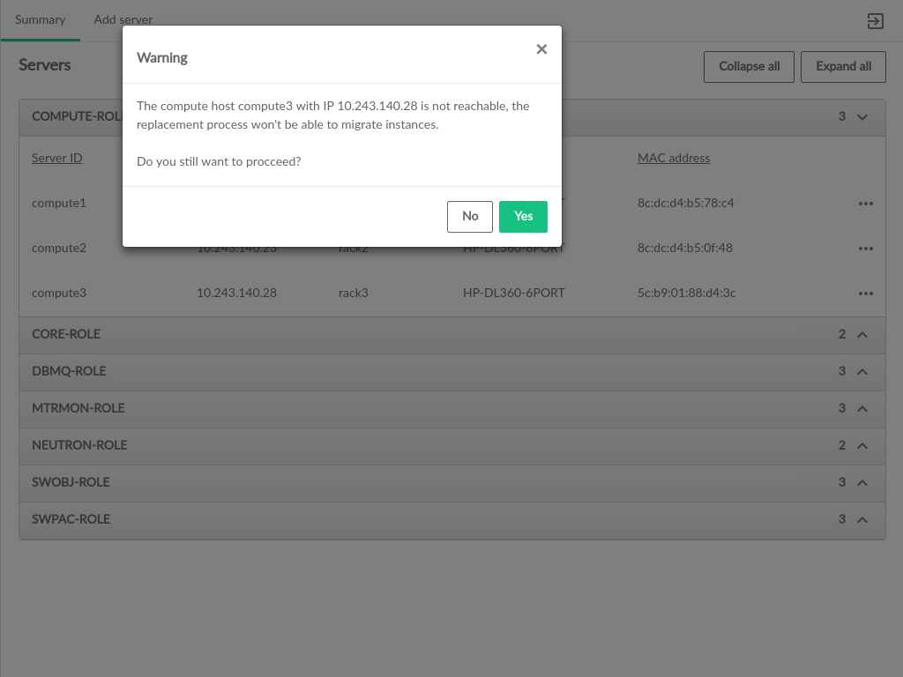

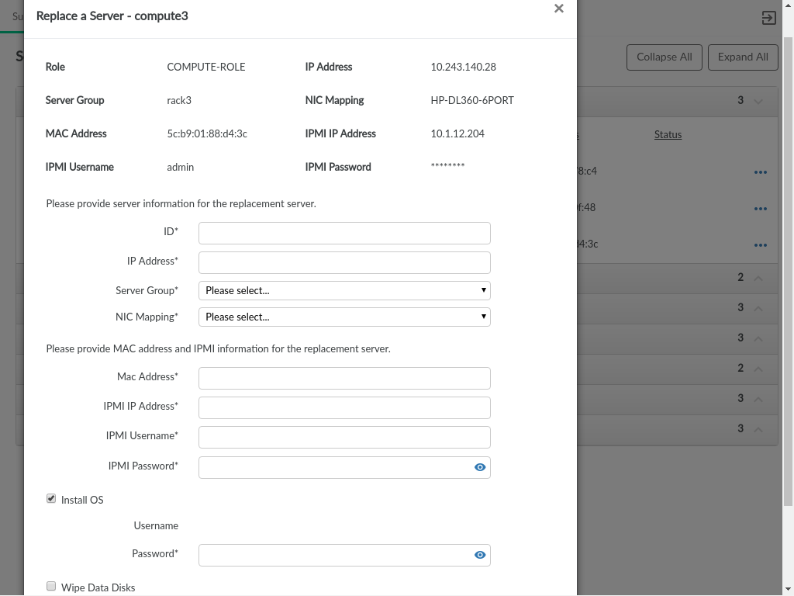

Because replacing a Compute server involves adding the new server
and then performing migration, an unused IP address is required, as
is a new ID, and selections for Server Group and NIC Mapping, which do
not need to match the original server.

ID::
  This is the ID of the server in the data model. This does not necessarily correspond to any 
  DNS or other naming labels a host has, unless it the host ID was set that way during install

IP Address::
  The management network IP address of the server

Server Group::
  The server group which this server is assigned to

NIC Mapping::
  The NIC mapping that describes the PCI slot addresses for the servers ethernet adapters
 

The new servers IPMI information is also required to perform the
replacement process. 

Mac Address::
  The hardware address of the servers primary physical ethernet adapter

IPMI IP Address::
  The network address for IPMI access to the new server

IPMI Username::
  The username credential for IPMI access to the new server

IPMI Password::
  The password associated with the user entered to access IPMI on the new server

If SLES is not already installed, or to reinstall SLES on the new server,
check the box for "Install OS". The username will be pre-populated with the
username from the Cloud install. Installing the OS requires specifying the
password that was used for deploying the cloud so that the replacement
process can access the host after the OS is installed.

The data disks on the new server will not be wiped by default, but users
can specify to wipe clean the data disks as part of the replacement process.

Once the new server information is set, click the "Replace" button in the lower
right to begin replacement. The configuration processor will be run to validate
that the entered information is compatible with the configuration of the Cloud.

Once validation has completed, the Compute replacement takes place in several
distinct steps, and each will have its own page with a list of process steps that will be
displayed, with a link at the bottom of the list to show the log
file as the changes are made.

The first step will be to install SLES if that option was selected

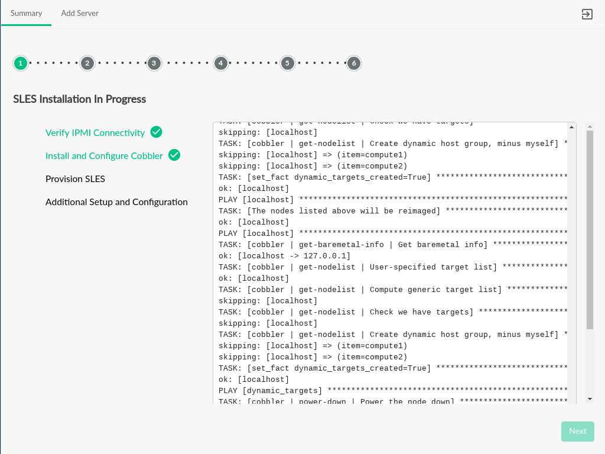

The second step will commit the changes to the data model and run the config processor

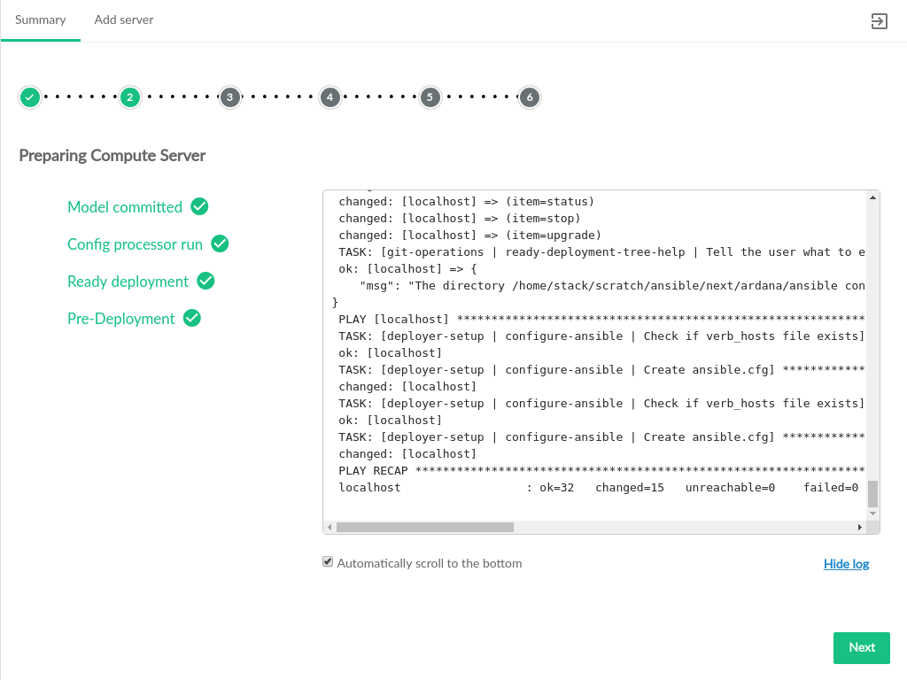

The third step will deploy the new server, installing services on it, updating Monasca (if installed),
and activating the server with the NOVA so that it can host VMs.

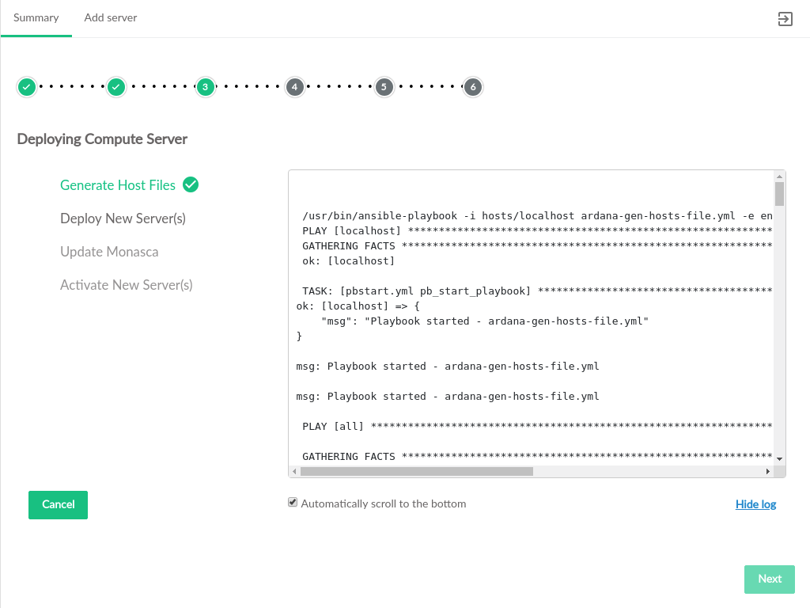

The fourth step will disable the existing server. If the existing server is unreachable, there may
be warnings about disabling services on that server.

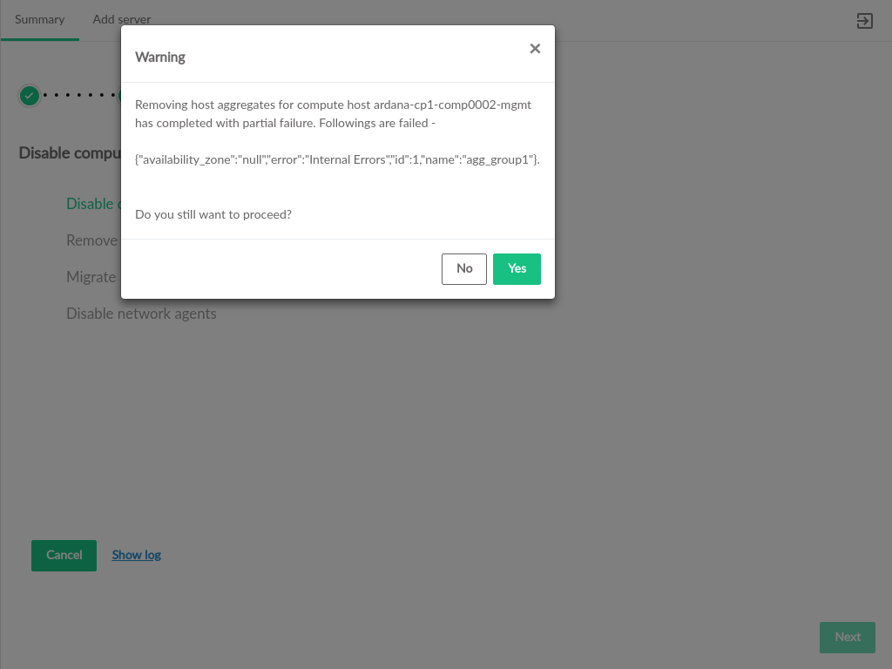

If the existing server is reachable, instances on that server will be migrated
to the new server.

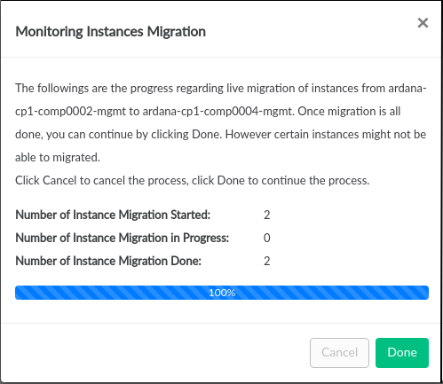

If the existing server is reachable, instances will be migrated from that server. If the
existing server is not reachable, the migration step will be skipped.

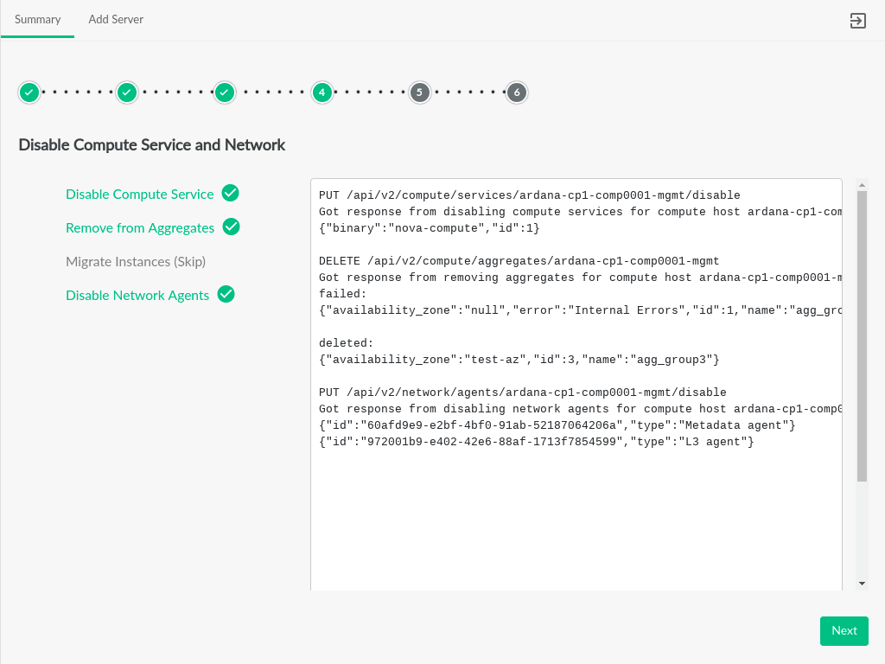

The fifth step in the replacement process is to remove the existing server from the
model and update the cloud configuration. If the server is not reachable, the user
is asked to verify that the server is shutdown. If server is reachable, the cloud
services running on it will be stopped and the server will be shutdown as part of the removal
from the Cloud.

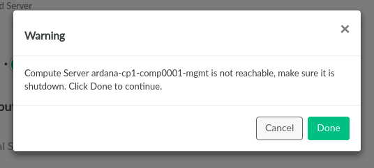

Upon verification that the unreachable host is shut down, it will be removed from the
data model.
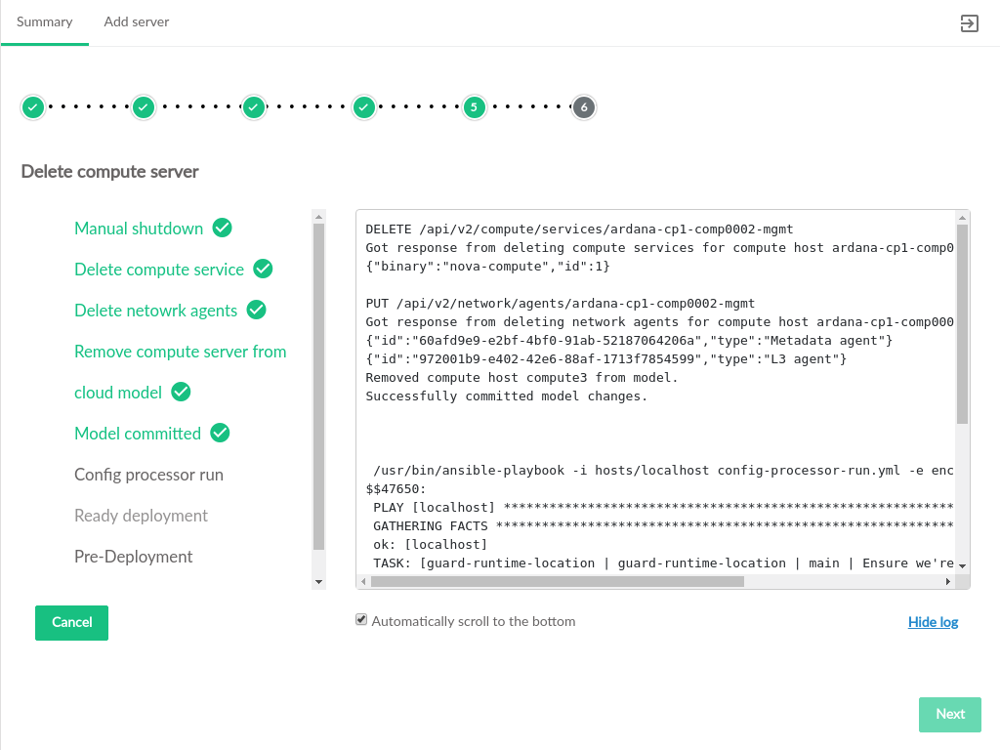

After the model has been updated, a summary of the changes will appear, click "Close" to 
return to the server summary screen.

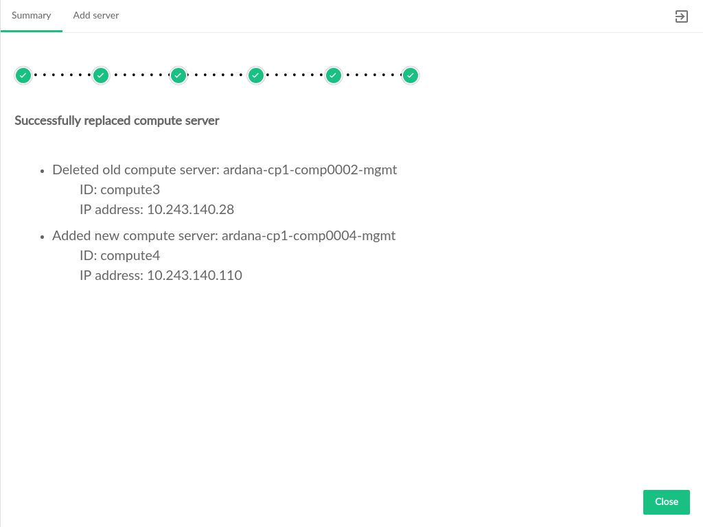

